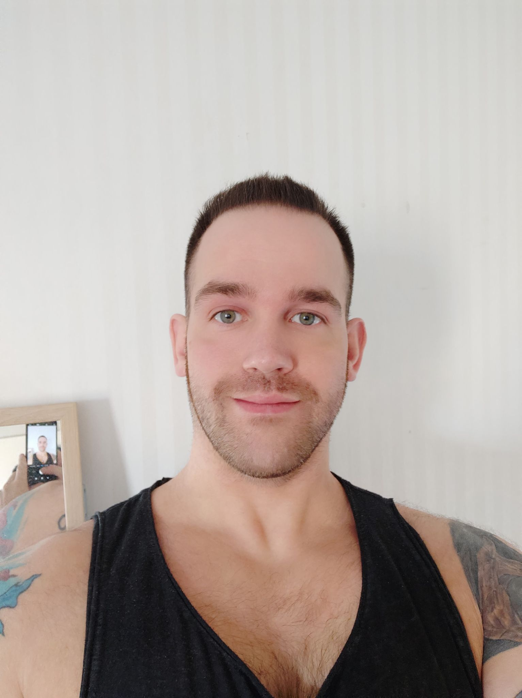

<!DOCTYPE html>
<html lang="sv">
    
<head>
    <link rel="stylesheet" href="style.css">
    
    <meta charset="UTF-8">
    <meta http-equiv="X-UA-Compatible" content="IE=edge">
    <meta name="viewport" content="width=device-width, initial-scale=1.0">
    <title>Portfolio - Jesper Jansson</title>
</head>

<body >
    <a href="index.html">Index</a>
    <a href="portfolio.html">Portfolio</a>
    <a href="contact.html">Kontaktuppgifter</a>
    
    <h1>Jesper Jansson</h1>
    
    
Jesper gillar katter och styrketräning är 181cm lång och väger som en  nyfödd elefantkalv. På inte-fritiden studerar Jesper på Nackademin till Javautvecklare.

     
    

        

        
Copyright &copy;2021 - Jesper Jansson – jesper.jansson@mensa.se

      

</body>
</html>
